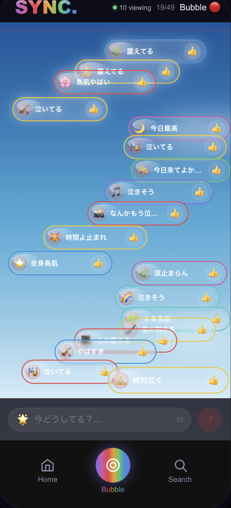

  

<h1 align="center">SYNC.</h1>

  Ending loneliness with technology. 
  <b>Connecting through passion.</b>

---

## 🌌 Experience

  

  <i>Real-time emotion. No filters. No history. Just presence.</i>

---

## 🧠 Concept

Why does loneliness increase, even as social networks grow?

In a world where people hide their true feelings,  
SYNC. exists to change that.

A new kind of social network  
that dissolves loneliness through shared emotional moments.

---

## 🌊 Philosophy

In a world optimized for efficiency,  
we choose emotion.

In a world driven by metrics,  
we choose presence.

---

## 🌍 Vision

Create a world where people connect through  
**real-time emotion and physical presence**,  
not numbers, algorithms, or curated identities.

---

## 🚀 What is SYNC.?

SYNC. is a proximity-based, offline-first social network.

- Connects people within 50m  
- No internet required  
- No likes, no followers  
- Messages disappear instantly  

---

## 🔥 Core System

- 📡 Proximity (Bluetooth + GPS)  
- 🚫 Zero Numbers  
- ⏳ Ephemeral Communication  
- 🛡 AI Moderation  

---

## 💡 Why Now?

AI is replacing efficiency.  
What remains human is **emotion and experience**.

SYNC. is built for that future.

---

## 💰 Business Model

- Event Intelligence (B2B SaaS)  
- Heat-based Recruiting  
- Emotional Analytics  

---

## 🛠 Status

- Prototype completed  
- Real-world testing done  
- Launch: May 2026  

---

## 👤 Founder

Building SYNC.  
Redefining human connection.

---

## 🌐 Future

SYNC. is not just a product.  
It is an **infrastructure for emotion.**

ーーーーーーーーーーーーーーーーーーーーーーーーーーーーーーーーーーーーーーーーーーーーーーーーーーーーーーー

Jpanese Version

  

<h1 align="center">SYNC.</h1>

  孤独を終わらせる。 
  <b>熱でつながる。</b>

---

## 🌌 体験

  

  <i>リアルタイムの感情。加工なし。蓄積なし。ただ「今」だけ。</i>

---

## 🧠 コンセプト

SNSが増えたのに、なぜ孤独は増え続けるのか？

SYNC.は「その場の感情」でつながり、  
孤独を溶かす新しいSNS。

---

## 🌊 思想

効率が最適化された世界で、  
私たちは「感情」を選ぶ。

数字に支配された世界で、  
私たちは「存在」を選ぶ。

---

## 🌍 ビジョン

**リアルタイムの感情と存在**でつながる世界をつくる。

---

## 🚀 SYNC.とは

- 半径50mの人と接続  
- インターネット不要  
- いいね・フォロワーなし  
- 投稿は消える  

---

## 🔥 コア設計

- 📡 近接通信  
- 🚫 数字の排除  
- ⏳ 刹那性  
- 🛡 安全設計  

---

## 💡 なぜ今か

AI時代に残る価値は  
「感情」と「体験」。

---

## 🛠 開発状況

- プロトタイプ完成  
- 実証実験済み  
- 2026年5月リリース予定  

---

## 🌐 未来

SYNC.は単なるSNSではない。  
**感情のインフラである。**
